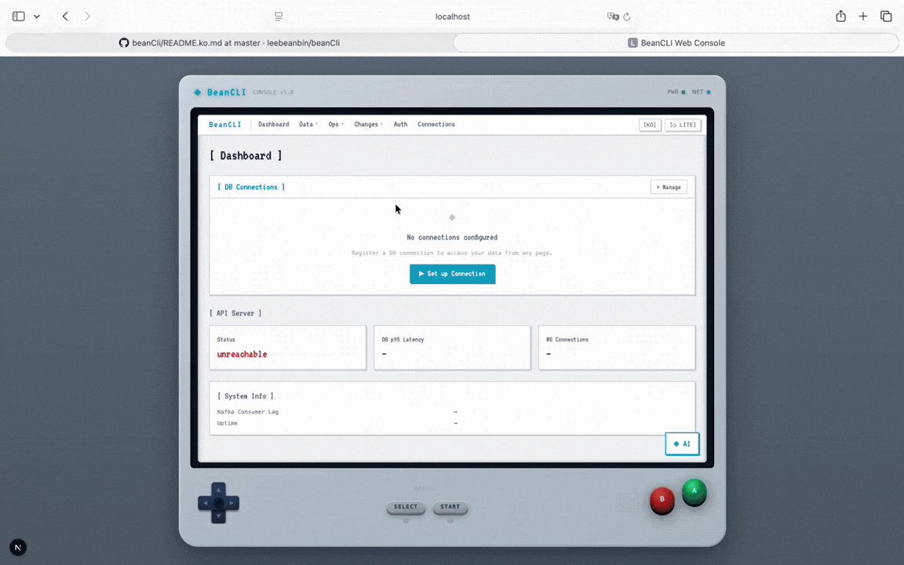

<div align="center">

```
╔══════════════════════════════════════════════════════════════════╗
║  ◈ BeanCLI  —  터미널 우선 데이터베이스 콘솔                      ║
╚══════════════════════════════════════════════════════════════════╝
```

[](https://nodejs.org)
[](https://www.typescriptlang.org)
[](https://pnpm.io)
[](https://turbo.build)
[](https://nextjs.org)
[](LICENSE)
[](https://github.com/leebeanbin/beanCli/commits/master)

**하나의 콘솔로 모든 데이터베이스를. 터미널 & 웹.**

[English →](README.md)

</div>

---

## BeanCLI란?

BeanCLI는 **개발자 중심 데이터베이스 관리 플랫폼**으로 두 가지 인터페이스를 제공합니다:

- **TUI** — 3-패널 레이아웃, 멀티라인 SQL 에디터, AI 어시스턴트, psql 스타일 메타 커맨드를 갖춘 풀-피처 터미널 UI (Ink/React).
- **웹 콘솔** — 레트로 게임보이 스타일의 Next.js 대시보드. 동일한 기능을 브라우저에서 사용 가능.

두 인터페이스 모두 **9가지 데이터베이스 타입**, 역할 기반 접근 제어, 불변 감사 로그, 통합 AI 어시스턴트를 지원합니다.

---

## 미리보기

<div align="center">
  
</div>

```
╔══ BeanCLI v0.1.2 ════════════════════════════════════════════════╗
║ Schema [1]      ║  Query Editor [2]                              ║
║─────────────────║──────────────────────────────────────────────  ║
║ > state_users   ║  1 │ SELECT u.entity_id_hash,                  ║
║   state_orders  ║  2 │        o.status, o.total_cents            ║
║   state_prod..  ║  3 │   FROM state_users u                      ║
║   payments      ║  4 │   JOIN state_orders o USING (user_id)     ║
║   shipments     ║  5 │  WHERE o.status = 'EXECUTING'             ║
║   audit_events  ║  6 │  LIMIT 50;               Enter: execute   ║
║   dlq_events    ╠════════════════════════════════════════════════╣
║                 ║  Results [3]          6 rows · 12ms            ║
║                 ║  entity_id_hash    status       total_cents     ║
║                 ║  > a3f7c2...       EXECUTING    $1,249.00       ║
║                 ║    b8e1d4...        DONE         $89.99         ║
╠═════════════════╬════════════════════════════════════════════════╣
║ ◈ AI [4]        ║  PG  leebeanbin › state_orders   DBA   dev     ║
╚═════════════════╩════════════════════════════════════════════════╝
```

---

## 주요 기능

| | |
|---|---|
| **9가지 DB 타입** | PostgreSQL · MySQL · SQLite · MongoDB · Redis · Kafka · RabbitMQ · Elasticsearch · NATS |
| **TUI (터미널 UI)** | 3-패널 Ink 레이아웃 — 스키마 트리 / SQL 에디터 / 결과 뷰어 |
| **웹 콘솔** | 게임보이 스타일 Next.js 앱 — 14개 페이지, 다크/라이트 테마, 한/영 전환 |
| **멀티라인 SQL 에디터** | 줄 번호, 커서 이동, 히스토리, psql 메타 커맨드 (`\dt`, `\d`, `\x`, `\export`, `\explain`, `\pw`) |
| **역할 기반 CRUD** | 행 탐색 · 편집 · 삽입 · 삭제 (DBA / MANAGER / ANALYST) |
| **변경 검토 워크플로우** | SQL → AST 파싱 → 위험 점수 → AUTO / CONFIRM / MANUAL |
| **AI 어시스턴트** | 전 페이지 `◈ AI` 플로팅 위젯 + 전용 `/ai` 채팅 페이지 |
| **감사 로그** | 불변 `audit_events` 테이블 — 모든 변경 기록 |
| **인증 시스템** | JWT 로그인(24h), bcrypt 패스워드, RBAC 가드, 관리자 유저 관리 |
| **Mock 모드** | DB/API 없이 전체 데모 — 개발·시연에 최적 |
| **연결 관리자** | DB 연결 등록, 테스트, 저장 GUI 폼 |
| **플러그인 API** | `--plugin ./adapter.js`로 커스텀 DB 어댑터 런타임 로드 |
| **한/영 언어 전환** | UI 언어 전환 (English / 한국어) — 브라우저에 설정 저장 |
| **보안** | AES-256-GCM 암호화 자격증명, 요청 제한, 로거 난독화 |

---

## 빠른 시작

### 요구사항

```
Node.js ≥ 20   ·   pnpm 10.28.1   ·   Docker (인프라용; Mock 모드에서는 불필요)
```

### 설치 및 실행

```bash
# 1. 최초 설정 (설치 + 글로벌 링크 + Docker 서비스 시작)
pnpm setup

# 2a. Mock 모드 — DB/API 없이 실행 (첫 실행에 추천)
beancli --mock

# 2b. 실제 모드 — Docker 인프라 필요
beancli

# 2c. 웹 콘솔만 실행
pnpm dev:web          # → http://localhost:3000

# 풀 스택 (API + Projector + Recovery Worker + TUI)
pnpm dev:all
```

### Docker (프로덕션)

```bash
# 이미지 빌드 + 전체 스택 한 번에 실행
make up

# 인프라만 실행 (Postgres + Kafka, 앱 컨테이너 제외)
make infra

# 로그 확인
make logs

# 전체 중지
make down
```

| 서비스 | URL |
|--------|-----|
| 웹 콘솔 | http://localhost:3000 |
| API 서버 | http://localhost:3100 |
| Kafka UI | http://localhost:8080 |
| PostgreSQL | localhost:5432 |

> **처음 설치하는 경우?** `pnpm setup` 후 새 터미널을 열면 `beancli` 명령어를 바로 사용할 수 있습니다.
> **이미 설치된 경우?** `pnpm link:global`을 한 번 실행하세요.

---

## 지원 데이터베이스

| 타입 | 기본 포트 | 비고 |
|---|---|---|
| `postgresql` | 5432 | 완전 지원. 풀 max=2 |
| `mysql` | 3306 | MariaDB 호환. 백틱 쿼팅 |
| `sqlite` | — | Node.js 내장 `node:sqlite` 사용 |
| `mongodb` | 27017 | 컬렉션을 테이블로 처리 |
| `redis` | 6379 | 키 프리픽스 = 테이블. HASH · LIST · SET · ZSET |
| `kafka` | 9092 | 토픽 목록 + 임시 컨슈머 메시지 조회 |
| `rabbitmq` | 5672 | Management API + AMQP 채널 큐 탐색 |
| `elasticsearch` | 9200 | 인덱스 목록 + 네이티브 JSON 쿼리 |
| `nats` | 4222 | JetStream 스트림 + 풀 컨슈머 |

---

## 웹 콘솔 페이지

| 페이지 | 경로 | 설명 |
|---|---|---|
| Dashboard | `/` | API 상태 · 저장된 DB 연결 현황 |
| Query | `/query` | SQL 에디터 + `[ Explain ]` 버튼 + CSV/JSON 다운로드 + `?sql=` 딥링크 |
| Explore | `/explore` | 데이터 탐색기 — 행 CRUD, 인라인 편집, 실시간 필터, 테이블 생성 모달 |
| Schema | `/schema` | 테이블 구조 뷰어 + EXPLAIN ANALYZE 트리 뷰 |
| Monitor | `/monitor` | 스트림 통계, SSE 실시간 업데이트 |
| Indexes | `/indexes` | 인덱스 목록 (사용률 % 바 포함), 생성, 삭제 |
| Audit | `/audit` | 불변 감사 로그 (카테고리 필터) |
| Recovery | `/recovery` | DLQ 실패 변경사항 재제출 |
| AI | `/ai` | 전용 AI 채팅 — SQL 블록 자동 감지 → `[ Run SQL ]` 버튼 |
| Changes | `/changes` | 변경 요청 목록, 상태 필터 탭 (ALL/DRAFT/PENDING/…), FAILED 시 `[Revert]` |
| Approvals | `/approvals` | 승인 대기 큐 |
| Auth | `/auth` | 로그인 폼 + 개발 계정 힌트 (JWT 24h) |
| Connections | `/connections` | API 서버 URL 설정, 연결 테스트 |
| Admin — Users | `/admin/users` | 유저 관리: 생성, 이름 변경, 비활성화 (DBA 전용) |

---

## 아키텍처

```
apps/
  cli/              ← TUI 진입점 (index-ink.tsx)
  api/              ← Fastify REST + WebSocket (포트 3100)
  web/              ← Next.js 15 웹 콘솔 (포트 3000)
  projector/        ← Kafka → PostgreSQL 상태 프로젝터
  recovery-worker/  ← DLQ 재처리기

packages/
  tui/              ← Ink 기반 TUI (현재 개발 중)
  kernel/           ← 공유 타입, Result<T,E>, ErrorCode
  domain/           ← DDD 애그리게이트 (ChangeRequest 상태 머신)
  application/      ← 유스케이스, 포트 인터페이스
  infrastructure/   ← DB 어댑터 (9가지), OCP 레지스트리 패턴
  policy/           ← ExecutionMode × RiskScore 정책 매트릭스
  audit/            ← 불변 감사 이벤트 기록기
  dsl/              ← SQL AST 파서 + WHERE 강제 적용
  sql/              ← DDL 마이그레이션 001–006
  ui-web/           ← 웹 콘솔용 공유 React 컴포넌트
```

### 의존성 방향

```
kernel → domain → application → infrastructure
                              ↗
               policy · audit · dsl (리프 패키지)
```

앱은 최상위에 위치하며 패키지에 의존합니다. 순환 의존 없음.

---

## TUI 시작 흐름

```
실행
  └─ ConnectionPicker (저장된 연결 목록 또는 새로 추가)
       └─ 연결됨
            └─ DatabasePicker (서버에서 데이터베이스 선택)
                 └─ TablePicker (테이블 선택)
                      └─ 메인 3-패널 UI
```

---

## 키보드 단축키

### 전역

| 키 | 동작 |
|---|---|
| `Ctrl+P` | 커맨드 팔레트 |
| `?` | 전체 단축키 도움말 오버레이 |
| `Tab` / `Shift+Tab` | 패널 간 이동 |
| `q` | 종료 |

### 패널 포커스

| 키 | 패널 |
|---|---|
| `1` | 스키마 (테이블 목록) |
| `2` | 쿼리 에디터 |
| `3` | 결과 |
| `4` | AI 어시스턴트 |

### 모드 전환

| 키 | 모드 |
|---|---|
| `t` | 테이블 피커 |
| `b` | Browse (행 탐색) |
| `m` | Monitor (스트림 통계) |
| `A` | 감사 로그 |
| `R` | DLQ Recovery |
| `I` | 인덱스 랩 |
| `C` | 변경 요청 |
| `P` | 승인 |

### SQL 에디터

| 키 | 동작 |
|---|---|
| `Enter` | SQL 실행 |
| `Shift+Enter` | 새 줄 |
| `↑` / `↓` (빈 버퍼) | 히스토리 |
| `Ctrl+A` / `Ctrl+E` | 줄 시작 / 끝 |
| `\dt` | 테이블 목록 |
| `\d <테이블>` | 테이블 구조 설명 |
| `\x` | 확장 모드 토글 |
| `\export csv\|json <파일>` | 현재 결과 내보내기 |
| `\explain <sql>` | EXPLAIN ANALYZE 실행 |
| `\pw` | 비밀번호 변경 (3단계 오버레이) |

### Browse / Explore 모드

| 키 | 동작 |
|---|---|
| `j` / `k` | 행 이동 |
| `h` / `l` | 열 이동 |
| `Enter` | 행 상세 |
| `e` | 행 편집 (DBA/MANAGER) |
| `i` | 행 삽입 (DBA/MANAGER) |
| `D` | 행 삭제 (DBA) |
| `Q` | 현재 테이블 SELECT → 쿼리 에디터 |
| `r` | 새로고침 |
| `f` | 필터 |

### 인덱스 랩 (`I`)

| 키 | 동작 |
|---|---|
| `n` | 인덱스 생성 (테이블 → 컬럼 → 이름, 3단계 인라인) |
| `d` | 선택된 인덱스 삭제 (y/N 확인) |
| `f` | 탭 전환 (인덱스 / 테이블 통계) |
| `/` | 필터 |
| `r` | 새로고침 |

---

## 변경 검토 워크플로우

```
SQL 제출
  └─ AST 파서 (WHERE 없는 UPDATE/DELETE 차단)
       └─ 위험도 평가
            ├─ L0: 행 수 < 10        → AUTO   즉시 실행
            ├─ L1: 10 ≤ 행 수 < 1000 → CONFIRM 사용자 확인
            └─ L2: 행 수 ≥ 1000 또는 DDL → MANUAL 승인 워크플로우
                 └─ 실행 → 감사 로그 → Kafka 이벤트
```

### 환경별 실행 정책

| 환경 | L0 | L1 | L2 |
|---|---|---|---|
| LOCAL / DEV | AUTO | AUTO | CONFIRM |
| PROD | CONFIRM | CONFIRM | MANUAL |

---

## 역할 기반 접근 제어

| 역할 | SELECT | INSERT | UPDATE | DELETE | DDL |
|---|---|---|---|---|---|
| `ANALYST` | ✅ | | | | |
| `MANAGER` | ✅ | ✅ | ✅ | | |
| `DBA` | ✅ | ✅ | ✅ | ✅ | ✅ |
| `SECURITY_ADMIN` | ✅ | | | | |

---

## 보안

| 레이어 | 구현 |
|---|---|
| **저장된 자격증명** | `~/.config/beanCli/connections.json` — AES-256-GCM, `chmod 600` |
| **엔티티 ID** | HMAC-SHA256 해시 (평문 ID 미저장; `ENTITY_ID_PLAIN_ENABLED`로 제어) |
| **SQL 인젝션** | 파라미터화 쿼리 + `quoteIdent()` 식별자 쿼팅 |
| **감사 로그** | `audit_events` — 애플리케이션 레이어에서 UPDATE/DELETE 불가 |
| **쿼리 안전** | 30초 강제 종료 + 모든 어댑터에서 5,000행 상한 |
| **요청 제한** | `@fastify/rate-limit` — 전역 60/분 · `/auth/login` 5/분 · `/auth/change-password` 5/시간 · `/connections/test` 10/분 |
| **로거** | Fastify pino가 `authorization`, `password`, `currentPassword`, `newPassword`, `credential`, `secret` 난독화 |
| **키 캐시** | `CachedKeyStore` — 5분 TTL 인메모리 (처리량 3–10배 향상) |
| **DB명 가드** | 허용 목록 정규식 `/^[a-zA-Z_][a-zA-Z0-9_$\-]{0,63}$/` |

---

## API 레퍼런스

기본 URL: `http://localhost:3100`

| 메서드 | 경로 | 설명 |
|---|---|---|
| `GET` | `/health` | 헬스 체크 |
| `POST` | `/api/v1/auth/login` | 로그인 (JWT 반환) |
| `POST` | `/api/v1/auth/change-password` | 현재 유저 비밀번호 변경 |
| `POST` | `/api/v1/changes` | SQL 변경 제출 |
| `GET` | `/api/v1/changes` | 변경 목록 조회 (`?status=` 필터) |
| `POST` | `/api/v1/changes/:id/execute` | 승인된 변경 실행 |
| `POST` | `/api/v1/changes/:id/submit` | 초안 → 승인 요청 |
| `POST` | `/api/v1/changes/:id/revert` | FAILED 변경 되돌리기 |
| `GET` | `/api/v1/audit` | 감사 로그 |
| `GET` | `/api/v1/schema/tables` | 테이블 목록 |
| `POST` | `/api/v1/schema/analyze` | EXPLAIN ANALYZE 실행 |
| `POST` | `/api/v1/indexes` | 인덱스 생성 |
| `DELETE` | `/api/v1/indexes/:name` | 인덱스 삭제 |
| `GET` | `/api/v1/state/:table` | 테이블 행 탐색 |
| `POST` | `/api/v1/sql/execute` | SQL 직접 실행 |
| `GET` | `/api/v1/monitoring/stream-stats` | 스트림 통계 |
| `POST` | `/api/v1/connections/test` | DB 연결 테스트 |
| `POST` | `/api/v1/connections/execute` | 외부 연결로 SQL 실행 |
| `POST` | `/api/v1/ai/stream` | AI SSE 스트림 |
| `WS` | `/ws` | 실시간 이벤트 스트림 |

---

## 환경 변수

| 변수 | 기본값 | 설명 |
|---|---|---|
| `APP_ENV` | `dev` | `local` / `dev` / `prod` |
| `DATABASE_URL` | — | PostgreSQL 연결 문자열 |
| `KAFKA_BROKER` | `localhost:9092` | Kafka 부트스트랩 서버 |
| `JWT_SECRET` | — | HS256 서명 키 |
| `ENTITY_ID_PLAIN_ENABLED` | `true` (dev) | 평문 엔티티 ID 저장 여부 |
| `API_URL` | `http://localhost:3100` | TUI → API 주소 |
| `NEXT_PUBLIC_API_URL` | `http://localhost:3100` | 웹 콘솔 → API 주소 |
| `MOCK` | — | `true`로 설정 시 Mock 모드 |

---

## Docker 인프라

| 서비스 | 포트 | 설명 |
|---|---|---|
| PostgreSQL 15 | 5432 | 주 데이터베이스 |
| Kafka | 9092 | 이벤트 스트리밍 |
| Kafka UI | 8080 | Kafka 브라우저 (개발용) |
| Zookeeper | 2181 | Kafka 코디네이션 |

```bash
pnpm docker:up       # 모든 서비스 시작
pnpm docker:wait     # 헬스 확인까지 대기
pnpm db:migrate      # SQL 마이그레이션 적용
pnpm docker:reset    # 볼륨 초기화 + 재시작
```

---

## 개발 명령어

```bash
# ── TUI ──────────────────────────────────────────────────────────
beancli               # 실제 모드 (API + DB 필요)
beancli --mock        # Mock 모드 (외부 서비스 불필요)
pnpm dev:mock         # Watch 모드, Mock
pnpm dev:cli          # Watch 모드, 실제

# ── 웹 콘솔 ──────────────────────────────────────────────────────
pnpm dev:web          # Next.js 개발 서버 → http://localhost:3000

# ── 풀 스택 ──────────────────────────────────────────────────────
pnpm dev:all          # 모든 앱 Watch 모드

# ── 빌드 & 타입 체크 ─────────────────────────────────────────────
pnpm build
pnpm --filter @tfsdc/tui exec tsc --noEmit
pnpm --filter @tfsdc/cli exec tsc --noEmit

# ── 테스트 / 린트 / 포맷 ─────────────────────────────────────────
pnpm test
pnpm test:watch
pnpm lint && pnpm lint:fix
pnpm format

# ── 글로벌 명령어 ─────────────────────────────────────────────────
pnpm link:global      # 글로벌 PATH에 beancli 등록
```

---

## 로드맵

| 항목 | 상태 |
|---|---|
| Ink TUI 3-패널 레이아웃 | ✅ 완료 |
| 9가지 DB 어댑터 (PG · MySQL · SQLite · MongoDB · Redis · Kafka · RabbitMQ · ES · NATS) | ✅ 완료 |
| CRUD + 역할 제어 | ✅ 완료 |
| 멀티라인 SQL 에디터 + psql 메타 커맨드 | ✅ 완료 |
| AI 어시스턴트 (SSE 스트리밍) | ✅ 완료 |
| ConnectionPicker → DatabasePicker 부트 플로우 | ✅ 완료 |
| 쿼리 타임아웃 + 행 제한 (전 어댑터) | ✅ 완료 |
| AES-256-GCM 자격증명 암호화 | ✅ 완료 |
| API 요청 제한 + 로거 난독화 | ✅ 완료 |
| 쿼리 히스토리 영속성 | ✅ 완료 |
| 웹 콘솔 — 14개 페이지 (Query, Explore, Schema, Monitor, Indexes, Audit, Recovery, AI …) | ✅ 완료 |
| 웹 콘솔 — 게임보이 레트로 쉘 UI (라이트/다크 테마) | ✅ 완료 |
| 웹 콘솔 — Connections 페이지 (DB 등록, 테스트, 관리) | ✅ 완료 |
| 웹 콘솔 — NavBar 드롭다운 그룹 + 뒤로가기 내비게이션 | ✅ 완료 |
| 웹 콘솔 — 플로팅 AI 채팅 위젯 (전 페이지) | ✅ 완료 |
| 웹 콘솔 — 한/영 언어 전환 (localStorage 저장) | ✅ 완료 |
| 웹 콘솔 — WebSocket LiveTableRefresh | ✅ 완료 |
| 웹 콘솔 — RBAC AccessGuard | ✅ 완료 |
| JWT 인증 시스템 (로그인 폼, 24h 토큰, 역할 기반 가드) | ✅ 완료 |
| 관리자 유저 관리 (생성, 이름 변경, 비활성화, RBAC) | ✅ 완료 |
| 플러그인 어댑터 API (`--plugin ./adapter.js`) | ✅ 완료 |
| EXPLAIN ANALYZE 트리 뷰 | ✅ 완료 |
| CSV / JSON 내보내기 (TUI `\export` + 웹 다운로드 버튼) | ✅ 완료 |
| TUI 변경 요청 패널 (`C`) + 승인 패널 (`P`) | ✅ 완료 |
| TUI `\explain <sql>` 메타 커맨드 (인라인 EXPLAIN ANALYZE) | ✅ 완료 |
| TUI `\pw` 비밀번호 변경 오버레이 (3단계: 현재 → 신규 → 확인) | ✅ 완료 |
| TUI 인덱스 랩: `n` 생성 · `d` 삭제 · 사용률 % 바 | ✅ 완료 |
| 웹 `/query` — `[ Explain ]` 버튼 + `?sql=` 딥링크 파라미터 | ✅ 완료 |
| 웹 `/changes` — 상태 필터 탭 + FAILED 행 `[Revert]` 버튼 | ✅ 완료 |
| 웹 `/explore` — 실시간 서브스트링 행 필터 | ✅ 완료 |
| 웹 `/indexes` — 스캔 카운트 기반 사용률 바 (████░░ N%) | ✅ 완료 |
| 웹 `/ai` — \`\`\`sql 블록 자동 감지 → `[ Run SQL ]` 버튼 | ✅ 완료 |

---

## Claude Code 커스텀 커맨드

`.claude/commands/`에 등록된 슬래시 커맨드:

| 커맨드 | 설명 |
|---|---|
| `/commit` | 주제별 커밋 가이드라인 |
| `/typecheck` | 전 패키지 TypeScript 검사 |
| `/test` | 테스트 실행 가이드 |
| `/issue` | GitHub Issue / PR 생성 |
| `/seed` | DB 샘플 데이터 투입 |
| `/perf` | 성능 감사 |

---

<div align="center">

[Ink](https://github.com/vadimdemedes/ink) · [Fastify](https://fastify.dev) · [Next.js](https://nextjs.org) · [kafkajs](https://kafka.js.org)로 만들었습니다

[이슈 신고](https://github.com/leebeanbin/beanCli/issues) · [English](README.md)

</div>
